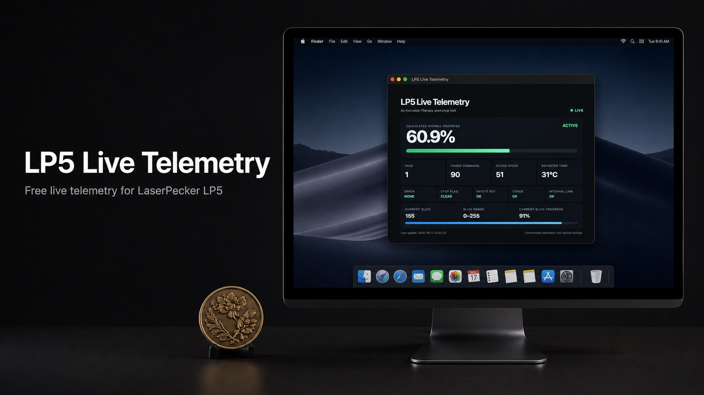

# LP5 Live Telemetry

### Free live telemetry for the LaserPecker LP5

## Download

| Platform | System | Installer |
| --- | --- | --- |
| **macOS** | Apple silicon | **[Download `.dmg`](https://github.com/rdcstout/lp5-live-telemetry/releases/download/v1.0.3/LP5.Live.Telemetry.1.0.3.Mac.arm64.dmg)** |
| **Windows** | 64-bit | **[Download `.exe`](https://github.com/rdcstout/lp5-live-telemetry/releases/download/v1.0.3/LP5.Live.Telemetry.Setup.1.0.3.Windows.x64.exe)** |

Downloads are free and are never gated behind payment. You can also browse the [latest GitHub release](../../releases/latest).

## See what your LP5 is doing

LP5 Live Telemetry is a free, read-only desktop monitor created by [Extrusion Therapy](https://extrusiontherapy.com/SoftwareLP5LiveTelemetry). It turns the telemetry records produced by LaserPecker Design Space into a clean, resizable dashboard that can remain visible while you work.

### At a glance

- Overall job and current-slice progress
- Current pass, commanded power, device speed, and reported temperature
- Active, paused, ready, transition, and idle states
- Error, stop, safety-key, cover, and internal-connection status
- Timestamp of the latest telemetry update

## How it works

LaserPecker Design Space must remain open and connected to the LP5 while a job is running. LP5 Live Telemetry reads its live telemetry records and presents the useful machine information in a dedicated window.

The app does **not** control the laser, alter projects, pause or stop jobs, or change machine settings.

## Support future tools

LP5 Live Telemetry is free. If it helps in your shop, you can optionally **[support future Extrusion Therapy tools](https://buy.stripe.com/fZu3cw2Mnfr0d7N3ws1kA00)**. The installers above remain available without payment.

## Source and support policy

This repository is the public distribution point for official releases. The source is maintained privately. Issues are disabled, and unsolicited pull requests may be closed without review.

## Independent utility

Created by Extrusion Therapy as an independent workshop utility. This application is not affiliated with or endorsed by LaserPecker.
